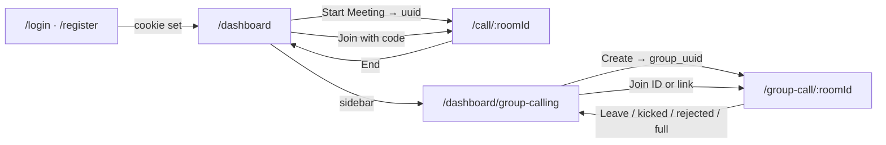
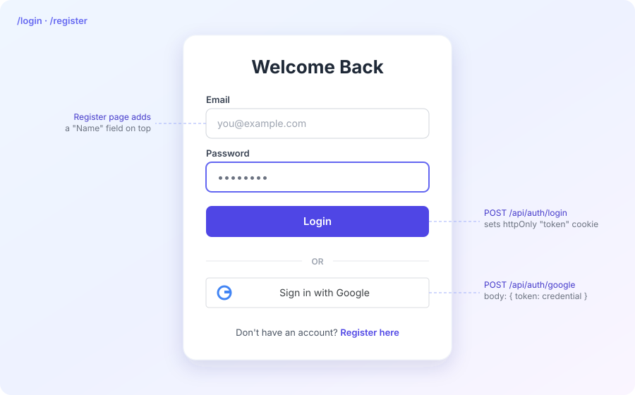
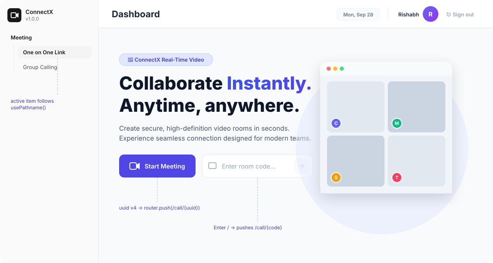
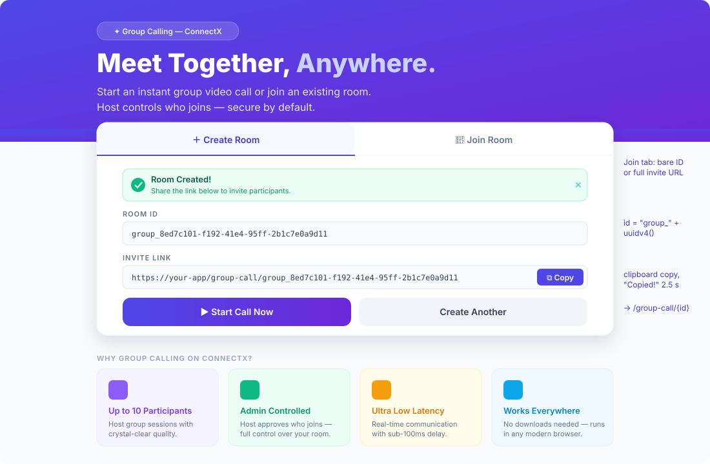
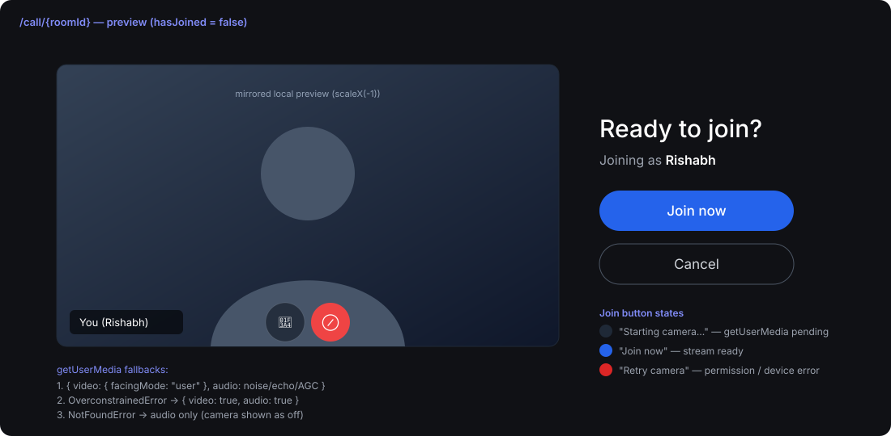
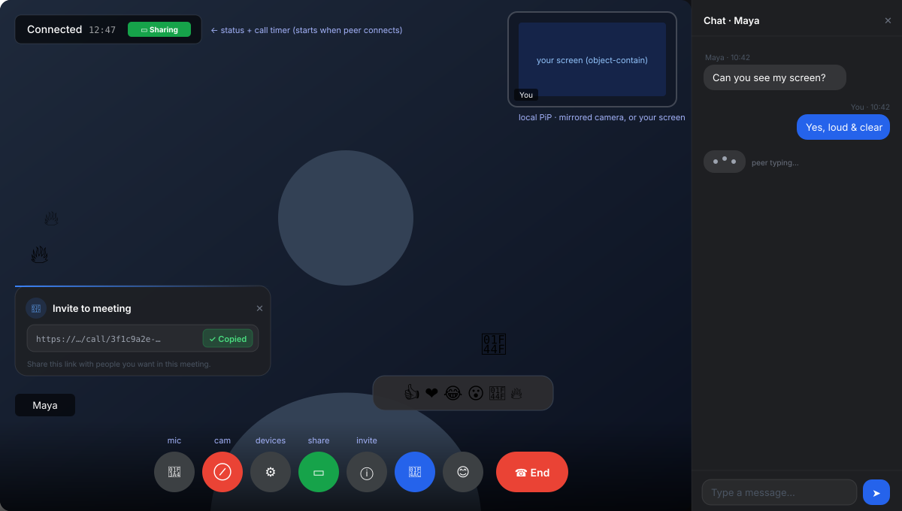
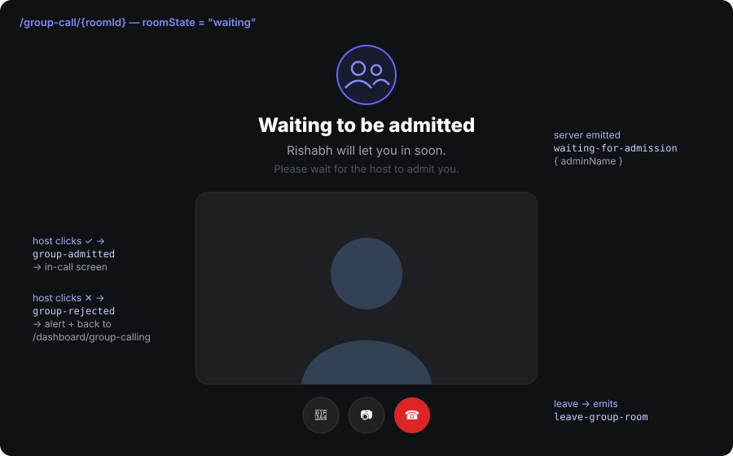
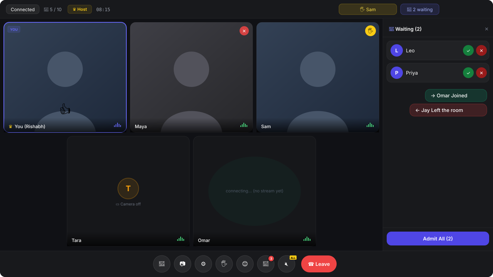
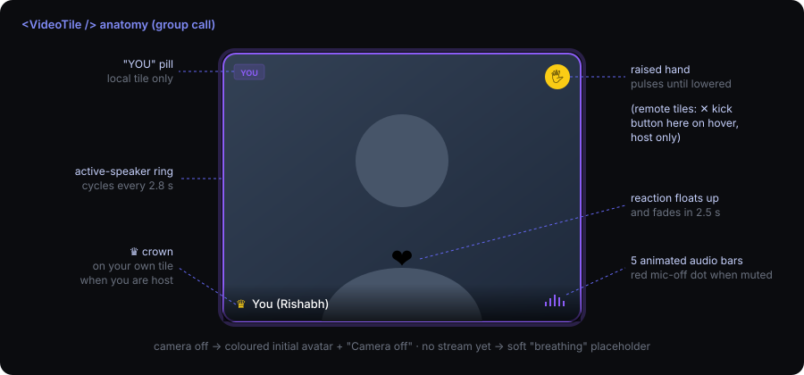

# ConnectX Frontend

A browser video-calling app built with **Next.js 16 + React 19**. It supports:

- **1-to-1 calls:** screen share, chat, emoji reactions, device switching.
- **Group calls of up to 10 people:** a host-controlled waiting room, raise hand, reactions, group chat, mute-all, kick, join/leave toasts and a call timer.

Video and audio travel **directly between browsers over WebRTC**. The backend only handles sign-in and passes signaling messages.


> **Backend repo:** [connectx-backend](https://github.com/rishabhchowkikar/connectx-backend). It's the Express + Socket.io server for auth and signaling, and its README has the full socket event reference.

---

## Table of Contents

- [Tech Stack](#tech-stack)
- [Project Structure](#project-structure)
- [Environment Variables](#environment-variables)
- [Getting Started](#getting-started)
- [How the app fits together](#how-the-app-fits-together)
- [Features — how each one works](#features--how-each-one-works)
  - [1. Sign in / register](#1-sign-in--register)
  - [2. Dashboard (1-to-1)](#2-dashboard-1-to-1)
  - [3. Group-calling dashboard](#3-group-calling-dashboard)
  - [4. 1-to-1 call — preview screen](#4-1-to-1-call--preview-screen)
  - [5. 1-to-1 call — live screen](#5-1-to-1-call--live-screen)
  - [6. Group call — preview & waiting room](#6-group-call--preview--waiting-room)
  - [7. Group call — live screen](#7-group-call--live-screen)
  - [8. Host (admin) controls](#8-host-admin-controls)
  - [9. Join / leave toasts & call duration](#9-join--leave-toasts--call-duration)
  - [10. Device switching](#10-device-switching)
  - [11. Surviving network drops](#11-surviving-network-drops)
- [WebRTC details](#webrtc-details)
- [Auth & route protection](#auth--route-protection)
- [Known limitations](#known-limitations)
- [Changelog (feature history)](#changelog-feature-history)

---

## Tech Stack

| Tool | Version | Purpose |
|------|---------|---------|
| Next.js (App Router) | 16.1.6 | Routing, layouts, middleware |
| React | 19.2.3 | UI |
| TypeScript | 5 | Types |
| Tailwind CSS | 4 | Styling (+ `tw-animate-css`) |
| shadcn/ui + Radix UI | — | Sidebar, sheet, tooltip, button, input primitives |
| lucide-react | ^0.575 | Icons |
| socket.io-client | ^4.8.3 | Signaling connection to the backend |
| WebRTC (browser API) | — | Camera, mic, screen share, peer connections |
| @react-oauth/google | ^0.13.4 | "Sign in with Google" button |
| axios | ^1.13.5 | REST calls with cookies (`withCredentials: true`) |
| uuid | ^13 | Room IDs |

---

## Project Structure

```
connectx-frontend/
├── src/
│   ├── app/
│   │   ├── layout.tsx                  # GoogleOAuthProvider → AuthProvider → page
│   │   ├── page.tsx                    # "/" → redirects to /dashboard or /login
│   │   ├── login/page.tsx              # Email/password + Google sign-in
│   │   ├── register/page.tsx           # Name/email/password + Google sign-up
│   │   ├── dashboard/
│   │   │   ├── layout.tsx              # Sidebar + top navbar shell
│   │   │   ├── page.tsx                # 1-to-1: Start Meeting / Join with code
│   │   │   └── group-calling/page.tsx  # Group: Create Room / Join Room
│   │   ├── call/[roomId]/page.tsx      # 1-to-1 call room (preview → live)
│   │   └── group-call/[roomId]/page.tsx# Group call room (preview → waiting → live)
│   ├── components/
│   │   ├── AppSidebar.tsx              # "One on One Link" / "Group Calling" nav
│   │   ├── DashboardNavbar.tsx         # Title, date, user avatar, Sign out
│   │   └── ui/                         # shadcn/ui primitives
│   ├── context/AuthContext.tsx         # user/loading state + login/register/google/logout
│   ├── hooks/
│   │   ├── useSocket.ts                # One Socket.io connection per page, 25 s heartbeat
│   │   └── use-mobile.ts               # Breakpoint hook used by the shadcn sidebar
│   ├── lib/api.ts, lib/utils.ts        # axios instance, `cn()` helper
│   └── middleware.ts                   # Edge middleware (pass-through; see Auth section)
└── docs/images/                        # Mockups used in this README
```

---

## Environment Variables

Create `.env.local`:

```env
# Backend base URL — used for REST (axios) AND the Socket.io connection
NEXT_PUBLIC_API_URL=http://localhost:5001

# Google OAuth Web Client ID (same value as GOOGLE_CLIENT_ID on the backend)
NEXT_PUBLIC_GOOGLE_CLIENT_ID=xxxxxxxx.apps.googleusercontent.com

# TURN relay credentials (metered.ca). 1-to-1 falls back to the public
# "openrelayproject" account if unset; GROUP CALLS HAVE NO FALLBACK.
NEXT_PUBLIC_TURN_USERNAME=your_turn_username
NEXT_PUBLIC_TURN_CREDENTIAL=your_turn_credential
```

If `NEXT_PUBLIC_API_URL` is missing, `AuthContext` logs an error and treats you as logged out.

---

## Getting Started

```bash
npm install
npm run dev      # http://localhost:3000
npm run build    # production build
npm run start    # serve the production build
npm run lint
```

The backend must be running and its `FRONTEND_URL` must equal this app's origin, otherwise the auth cookie is blocked by CORS.

> Camera, microphone and screen-share APIs only work over **HTTPS** or on `localhost`. To test on a phone, deploy the app or use an HTTPS tunnel.

---

## How the app fits together



Every page that needs a user reads `useAuth()` from `AuthContext`, and sends the visitor to `/login` if nobody is signed in.

---

## Features — how each one works

### 1. Sign in / register

<p align="center"></p>

**Files:** [src/context/AuthContext.tsx](src/context/AuthContext.tsx), [src/app/login/page.tsx](src/app/login/page.tsx), [src/app/register/page.tsx](src/app/register/page.tsx)

- **Email + password.** Calls `login()` / `register()`, which POST to `/api/auth/login` or `/api/auth/register`. The backend puts the JWT in an **httpOnly `token` cookie**, so JavaScript never sees it. On success the page does a full reload (`window.location.href = "/dashboard"`) so the new cookie is definitely in place.
- **Google.** `<GoogleLogin>` returns a `credential` (ID token). `googleAuth(credential)` POSTs `{ token }` to `/api/auth/google`, and the backend verifies it with Google. It works as sign-up or sign-in, and links Google to an existing account that has the same email.
- **Errors.** The backend's `msg` is stored in context and shown as a red banner above the form.
- **App start.** `AuthProvider` calls `GET /api/auth/me` once. The browser sends the cookie automatically, and the response fills in `user`. While that request is in flight, `loading` is `true` and pages show "Loading…".
- **Logout.** The navbar's **Sign out** calls `POST /api/auth/logout`, clears `user`, and hard-navigates to `/login`.
- **Already signed in.** Login and register redirect to `/dashboard`. `/` redirects based on auth state.

### 2. Dashboard (1-to-1)

<p align="center"></p>

**Files:** [src/app/dashboard/page.tsx](src/app/dashboard/page.tsx), [src/app/dashboard/layout.tsx](src/app/dashboard/layout.tsx), [src/components/AppSidebar.tsx](src/components/AppSidebar.tsx), [src/components/DashboardNavbar.tsx](src/components/DashboardNavbar.tsx)

| Element | What it does |
|---|---|
| **Sidebar** | "Meeting" → *One on One Link* (`/dashboard`) and *Group Calling* (`/dashboard/group-calling`). The current page is highlighted with `usePathname()`. |
| **Navbar** | Page title, today's date, your name, an initial avatar, and **Sign out**. |
| **Start Meeting** | Generates a UUID v4 and opens `/call/{uuid}`. You're the first person in the room. |
| **Enter room code** | Press Enter or click → to open `/call/{code}`. |

### 3. Group-calling dashboard

<p align="center"></p>

**File:** [src/app/dashboard/group-calling/page.tsx](src/app/dashboard/group-calling/page.tsx)

- **Create Room.** Shows a spinner for 600 ms, then generates `group_<uuid>` and shows **Room Created!** with the room ID, the full invite link, and **Copy**. Copy uses `navigator.clipboard` and shows "Copied!" for 2.5 s. **Start Call Now** opens `/group-call/{id}`. You'll be the **host**, because the first person into a room becomes admin.
- **Join Room.** Accepts a bare ID or a full pasted link. Anything after `/group-call/` (or `/call/`) is taken as the ID, and it always opens `/group-call/{id}`.
- **Feature cards.** Four static cards: Up to 10 participants, Admin controlled, Low latency, Works everywhere.

### 4. 1-to-1 call — preview screen

<p align="center"></p>

**File:** [src/app/call/[roomId]/page.tsx](src/app/call/%5BroomId%5D/page.tsx)

- **Camera start.** On mount, `initMedia()` asks for camera and mic with noise suppression, echo cancellation and auto-gain. If that fails, it falls back step by step:
  - **Denied permission** shows an overlay with **Retry**, and the Join button becomes **Retry camera**.
  - **No camera found** retries with **audio only**, and the preview shows your initial.
  - **Overconstrained** (the camera can't meet the request) retries with a plain `{ video: true, audio: true }`.
- **Preview.** The camera preview is mirrored. The mic and camera toggles work before you join.
- **Join now.** Calls `video.play()` inside the click handler. That click counts as a user gesture, which iOS Safari and in-app browsers (WhatsApp, Slack) require before they'll play video.
- **Cancel** stops the camera and returns to `/dashboard`.

### 5. 1-to-1 call — live screen

<p align="center"></p>

**Layout**

- The other person's video fills the screen. Until they connect, a pulsing **"Waiting"** circle shows instead.
- Your own video is a **picture-in-picture tile** in the top-right. It's mirrored normally, and shows your screen without mirroring while you share.
- **Status badge** (top-left): *Initializing media… → Ready to join → Connecting to room… → Name joined. Negotiating… → Connected*. Once connected it adds a **call timer** (`MM:SS`, or `H:MM:SS` after an hour) and a green **Sharing** tag while you share your screen.
- The remote user's name is shown at bottom-left.
- **Controls auto-hide** 4 s after the last mouse move or touch. They stay visible while the chat, device picker or invite popup is open.

**Controls bar**

| Button | How it works |
|---|---|
| 🎤 Mic | Toggles `enabled` on your audio track. Red when muted. |
| 📷 Camera | Toggles `enabled` on your video track. Your PiP shows your initial when off. |
| ⚙ Devices | Lists cameras and mics. Picking one gets a new track and swaps it into the call with `RTCRtpSender.replaceTrack()`, so there's no renegotiation. |
| 🖥 Share screen | Desktop only (hidden on Android/iPhone/iPad). Uses `getDisplayMedia()` and `replaceTrack()`. Clicking again, or the browser's own "Stop sharing" button, switches back to the camera. |
| ⓘ Invite | Popup with the `/call/{roomId}` link and a **Copy** button (turns into "✓ Copied" plus a toast). It opens automatically when you join and closes itself when the other person connects. |
| 💬 Chat | Opens the chat panel, with a red unread badge (9+ cap) while it's closed. |
| 😊 Reactions | Only shown once connected. Six emoji: 👍 ❤️ 😂 😮 👏 🔥. Your reaction floats up on the right and theirs on the left, and each fades out over 3 s. Sent as `send-reaction`. |
| ☎ End | Stops the camera, mic and screen share, closes the peer connection, disconnects the socket, and returns to `/dashboard`. |

**Chat**

- The chat panel is a bottom sheet (70% height) on mobile and a 288 px side panel on desktop.
- Messages go only to the other person, never echoed back. Each one shows the sender and time (`HH:MM`).
- **Typing indicator:** typing sends `isTyping: true`, and 1.5 s without a keystroke (or sending) sends `false`. The other side shows three bouncing dots.
- Input is disabled ("Waiting for peer…") until the other person is connected.

**Connection (WebRTC)**

- The server sends `ready` to the person who was in the room first. **Only they create the offer**, so the two sides never offer at the same time.
- ICE candidates that arrive before the remote description is set are **queued**, then added once it's set.

### 6. Group call — preview & waiting room

<p align="center"></p>

**File:** [src/app/group-call/[roomId]/page.tsx](src/app/group-call/%5BroomId%5D/page.tsx)

A group room moves through three screens: `preview → waiting → in-call`.

1. **Preview.** A camera preview with mic/camera toggles, the room ID, **Join Now** and **Cancel**. If the browser blocked the camera on page load, clicking **Join Now** asks again, because some in-app browsers only allow camera access after a tap.
2. **Joining** emits `join-group-room`. What happens next depends on the room:
   - **New room:** `group-joined { isAdmin: true }`. You're the host and go straight into the call.
   - **Existing room:** `waiting-for-admission { adminName }`. The **Waiting to be admitted** screen shows "*{host}* will let you in soon". Your camera preview and mic/camera/leave buttons stay available.
   - **Admitted:** `group-admitted` moves you to the live screen.
   - **Rejected:** `group-rejected` shows an alert and sends you back to `/dashboard/group-calling`.
   - **Room full (10):** `group-room-full` shows an alert and sends you back to the same page.

### 7. Group call — live screen

<p align="center"></p>

**Top bar**

- Left side: call status, participant count (`N / 10`), a **♛ Host** badge if you're the host, and the **call timer**.
- Right side (host only): a 🖐️ chip listing everyone with a raised hand, and a pulsing **"N waiting"** button that opens and closes the waiting panel.

**Video grid.** The number of columns and rows depends on how many people are in the call:

| People | Desktop | Mobile (&lt; 768 px) |
|---|---|---|
| 1 | 1 × 1 | 1 × 1 |
| 2 | 2 × 1 | 1 × 2 |
| 3 | 3 × 1 | 2 × 2 |
| 4 | 2 × 2 | 2 × 2 |
| 5–6 | 3 × 2 | 2 × 3 |
| 7–8 | 4 × 2 | 2 × N (scrolls) |
| 9 | 3 × 3 | 2 × N (scrolls) |
| 10 | 5 × 2 | 2 × N (scrolls) |

- An incomplete last row is **centered** (`getOrphanStyle`).
- With **7 or more** people the tiles switch to a compact size (smaller avatar, text and gaps).

**Video tile**

<p align="center"></p>

Each tile has:

- **Picture.** Live video. With the camera off it shows a colored initial avatar and "Camera off". While a peer's stream is still arriving, a soft "breathing" placeholder shows.
- **Name bar.** Your tile reads `You (name)` and has a **YOU** pill. The **♛ crown** shows on your own tile when you're host.
- **Audio bars.** Five animated bars, or a red mic-off dot when you're muted.
- **Speaker highlight.** A glowing colored border that **moves to the next tile every 2.8 s**. It's a visual effect, not real voice detection.
- **Raise hand.** A pulsing yellow 🖐️ badge until the person lowers their hand.
- **Reactions.** An emoji that floats up from that person's tile and fades out over 2.5 s.
- **Kick.** Hovering a remote tile shows a red **✕** kick button, for the host only.

**Controls bar**

| Button | How it works |
|---|---|
| 🎤 / 📷 | Toggle your mic / camera track. |
| ⚙ Media settings | Choose camera, **microphone** and **speaker** (see [Device switching](#10-device-switching)). |
| 🔄 Flip | Mobile only. Switches between front and back camera. |
| 🖐️ Raise hand | Sends `group-raise-hand { isRaised }`. The button turns yellow while your hand is up, and everyone else's tile for you shows the badge. |
| 😊 Reactions | Same 6 emoji as 1-to-1. The picker **stays open** so you can send several in a row. Sends `group-reaction`, and receivers animate the sender's tile. |
| 💬 Chat | **Group chat**: a side panel on desktop, a bottom sheet on mobile. Shows the sender's name, time, "*Name* is typing…", and an unread badge. |
| 🔇 ALL | Host only. **Mute everyone** (see below). |
| ☎ Leave | Stops your camera and mic, closes all peer connections, **emits `leave-group-room`** so the others see you leave right away, then disconnects and returns to `/dashboard/group-calling`. |

### 8. Host (admin) controls

The **first person to join a room is the host**. If the host leaves, the longest-standing remaining participant becomes host. They see "You are now the host" and get all of the controls below.

| Control | What happens |
|---|---|
| **Admit / Reject** | Each person knocking shows in the waiting panel (desktop) with ✓ and ✕ buttons. Admitting sends `admit-user`. The server adds them, and each existing participant opens a WebRTC connection to them. Rejecting sends `reject-user`, and they see an alert. |
| **Admit All** | Shown when 2 or more people are waiting. Admits each of them. |
| **Mute All** | Emits `group-mute-all`. Every other participant's app turns off their own mic and shows it as muted. The host mutes themselves too. Anyone can unmute themselves afterwards. |
| **Kick** | Hover a tile and click ✕ to emit `kick-participant`. The kicked user sees *"You were removed from the call by the host."* and is taken out of the call. Everyone else loses that tile immediately. The kicked user can't use the reconnect window to slip back in. |
| **Raised hands** | The top-bar chip lists everyone whose hand is up. |

### 9. Join / leave toasts & call duration

- **Toasts** stack in the top-right and disappear after **3 s**:
  - green **"→ Name Joined"** when a new peer arrives (`group-new-peer`),
  - red **"← Name Left the room"** when a peer leaves or is kicked (`group-peer-left`).
- **Call duration.** In a group call, the timer starts on the host's screen when the first other person joins (see [Known limitations](#known-limitations)). It's shown in the top bar as `MM:SS`, or `H:MM:SS` after an hour. It stops when you leave. In a 1-to-1 call, the timer runs while the other person is connected and resets if they disconnect.

### 10. Device switching

| | 1-to-1 | Group |
|---|---|---|
| Camera | ✅ `getUserMedia({ deviceId: exact })` + `replaceTrack` | ✅ Desktop: by `deviceId`. Mobile: by `facingMode` (worked out from the label: front/back/rear) |
| Microphone | ✅ | ✅ keeps your current mute state |
| Speaker | — | ✅ `HTMLMediaElement.setSinkId()` on every remote `<video>` (Chrome/Edge) |
| Flip camera button | — | ✅ mobile, `facingMode: { exact: "user" / "environment" }` |
| Screen share | ✅ desktop | — |

These tweaks stop Android phones from showing a black tile while switching cameras:

1. Show the avatar while switching.
2. Wait 300 ms so the camera hardware can settle.
3. Wait for the new track to go live (or 800 ms), then `replaceTrack` it on **every** peer connection.
4. **Swap the track inside the existing `MediaStream`** instead of creating a new stream, and bump `localStreamVersion` so the tile re-attaches the video.

A back camera isn't mirrored.

### 11. Surviving network drops

`useSocket` reconnects forever: it waits 1 s before the first retry, backing off up to 5 s between attempts. It also sends a `ping` every **25 s** so mobile browsers and proxies don't treat the socket as idle.

- **1-to-1**
  - When the socket reconnects, the page rebuilds the peer connection if it's dead and sends `join-room` again. The server replaces the old entry that has the same name.
  - If the peer connection itself **fails**, the page closes it, shows "Reconnecting…", and rebuilds it after 2 s.
  - ICE `failed` triggers `restartIce()`. So does ICE staying `disconnected` for 3 s.
  - When the other person drops, the status shows a 10 s "waiting to rejoin" countdown. They can rejoin the same link.
- **Group**
  - When the socket reconnects while you're waiting or in the call, the page sends `join-group-room` again.
  - The server holds your seat for **12 s**, so you come back as a participant (still host, if you were) without re-admission.
  - Everyone else first drops your old tile, then reconnects to you. The page also removes any leftover "ghost" participant with the same name before adding the new one.
  - ICE `failed` on a peer connection triggers an ICE-restart offer to that peer.

---

## WebRTC details

| | 1-to-1 (`/call`) | Group (`/group-call`) |
|---|---|---|
| Topology | 1 peer connection | **Full mesh**: one peer connection per other participant, stored in `Map<socketId, RTCPeerConnection>` |
| Connections per call | 1 | N × (N − 1) / 2 in total (up to 45 at 10 people); each browser holds N − 1 |
| Who offers | First user in the room (on `ready`) | Existing participants, to the newcomer (on `group-new-peer`) |
| STUN | `stun{,1,2,3}.l.google.com:19302` | `stun`, `stun1.l.google.com:19302` |
| TURN | `openrelay.metered.ca` 80/443/443-tcp/turns 443 | `global.relay.metered.ca` 80/80-tcp/443/turns 443 |
| Extra config | `iceCandidatePoolSize: 10`, `bundlePolicy: max-bundle`, `rtcpMuxPolicy: require` | defaults |
| Early ICE candidates | Queued until remote description set | Added immediately (errors logged) |

---

## Auth & route protection

- **Where the check happens.** Auth is checked **in the browser**. Protected pages (`/dashboard`, `/dashboard/group-calling`, `/call/*`, `/group-call/*`) wait for `AuthContext` to finish loading. They show "Loading…" meanwhile, and send you to `/login` if nobody is signed in.
- **Why the middleware doesn't check.** [src/middleware.ts](src/middleware.ts) runs on every page request but currently **lets everything through**. In production the backend is on a different domain, so its httpOnly cookie never reaches the Next.js server, and the middleware can't see it.
- **What actually protects the data.** The backend. Every protected REST call requires a valid JWT cookie.

---

## Known limitations

These are current behaviors, found while reading the code, that are worth knowing about:

- **The speaker highlight isn't real.** It just moves from tile to tile every 2.8 s. The audio bars are also animations, not actual volume levels.
- **You can't see other people's mute or camera state.** Remote tiles always show "unmuted" and only show the avatar when no video arrives. Your own mute/camera state isn't sent to anyone.
- **The host crown only shows on the host's own screen.** Other participants don't see who the host is.
- **Hosts on mobile can't admit people.** The waiting panel is desktop only. A host on a phone sees "N waiting" but has no admit button.
- **In practice, only the host sees the group call timer.** It starts when a `group-new-peer` arrives while you have no other participants. That only happens to whoever opened the room. People admitted later already have participants when they arrive, so their timer never starts.
- **No screen sharing in group calls.**
- **Group calls need TURN credentials.** They have no public TURN fallback, so they may fail behind strict NATs if `NEXT_PUBLIC_TURN_*` isn't set.
- **Mesh limits.** Every browser uploads its video separately to every other participant. Calls with 6 to 10 people are heavy on upload bandwidth and CPU.

---

## Changelog (feature history)

Most recent first, from this repo's git history.

| Commit | Date | Change |
|---|---|---|
| `05e948d` | 2026-06-13 | README screenshot. |
| `fa186de` | 2026-06-13 | 1-to-1 TURN credentials read from `NEXT_PUBLIC_TURN_USERNAME` / `NEXT_PUBLIC_TURN_CREDENTIAL` (public fallback kept). |
| `01ce717` | 2026-05-03 | **Kick participant** (host), **call duration timer** in group top bar, **join/leave toasts**. |
| `9f13cf5` | 2026-05-02 | Proper end-call handling (`leave-group-room`) and ghost-tile cleanup. |
| `1b6b433` | 2026-05-02 | Fix black tiles when switching cameras. |
| `719ed78` | 2026-04-19 | 1-to-1 call survives socket reconnects (rejoin + peer connection rebuild). |
| `3e62e28` | 2026-04-18 | Flip-camera button (mobile). |
| `fdc2978` | 2026-04-12 | Connection stability fix for long calls. |
| `7ad49db`, `19dca75` | 2026-04-11 | Device switching in group calls; mobile group-call fixes. |
| `2fb89c3` | 2026-03-29 | Group reactions and raise hand. |
| `7e697b4` | 2026-03-21 | Group chat. |
| `8b7ccb0` | 2026-03-21 | Floating reactions in 1-to-1 calls. |
| `74cde4b` | 2026-03-20 | Mac-to-Mac connectivity fix: ICE restart on failure, early-candidate queue, candidate pool. |
| `df60781` | 2026-03-16 | PiP layout and screen sharing UI. |
